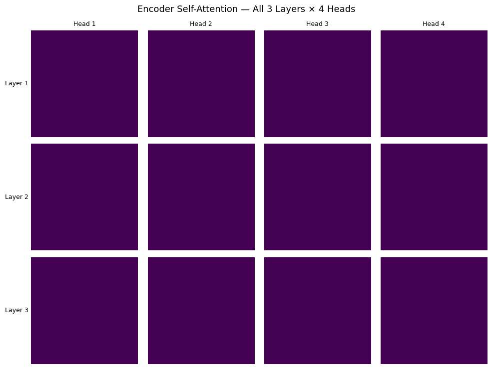
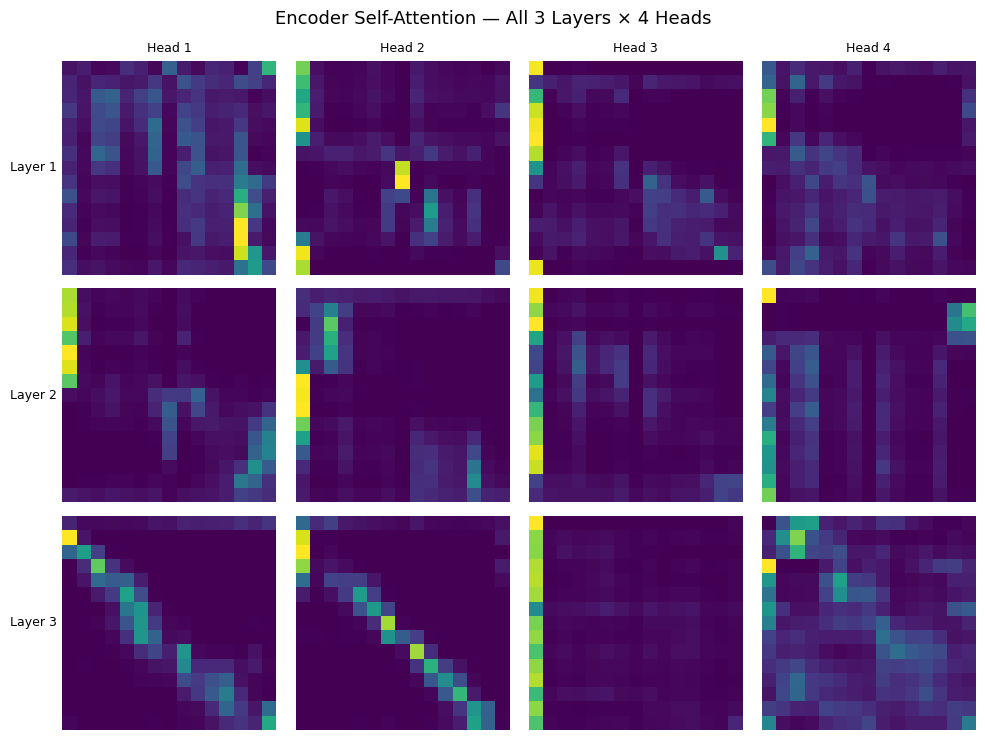
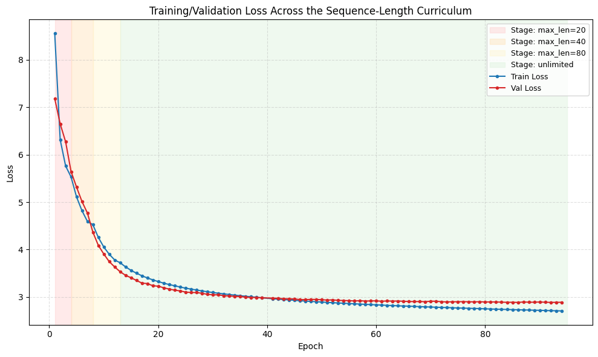
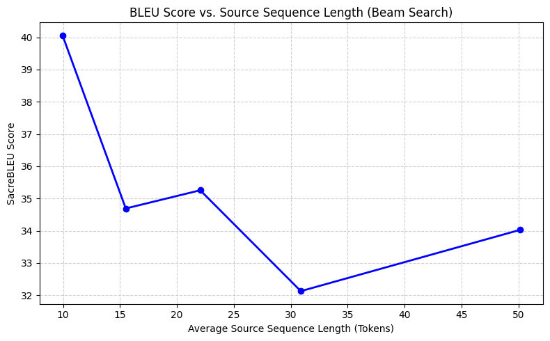

# What is this project

During my masters I was very fond of the transformer model I learned of during my Deep Learning course. My thesis ended up being about using an LLM (GPT-4 based ChatGPT) to learn about Machine Learning concepts, more specifically, Transformers. Ironically, this project also serves as a platform for me to learn agentic coding.
Now, I wanted to improve my model, a machine translation transformer, as it was severly lacking in multiple aspects. One of the most important things to focus on was using benchmark datasets with comparable results, which I should have already used previously. 


This project consists of two stages, which are similar models for the IWSLT17 de-en dataset and IWSLT14 de-en dataset. Both contain german sentences from TED talks translated to english. The reason for the '17 dataset being first is that I was comparing a bilingual model trained on small data to multilingual models on small data. 
Even though there was some evidence of multilingual models outperforming bilingual models on the few small datasets, which employed both methods, I generally do not wish to generalize based on such a small sample, with it also being on a different language combination dataset. 
That being said, I have completed the '17 model, which reached the following results:

The architecture and params for phase1 (IWSLT17) and phase2 (IWSLT14) look as follows:

|               | d_model | enc/dec layers | heads | dropout |   Params   |
| ------------- |:-------:|:--------------:|:-----:|:-------:|:----------:|
| Phase 1       | 256     |     3/4        | 4     | 0.101   | 17,951,248 |
| Phase 2       | 512     |     5/6        | 8     | 0.116   | 44,812,560 |

## Phase 1

1: Hugging Face provided test set (consisting of test sets 2010-2015)

- SacreBLEU Score: 24.16
- chrF Score:      47.07
- TER Score:       60.08
- NIST Score:      6.4209

Generated Sample Comparison 
```
Predicted: A couple of years ago, at TED, Peter Skillman asked a design competition called "The Marshallow House challenge."  
Reference: Several years ago here at TED, Peter Skillman introduced a design challenge called the marshmallow challenge.  

Predicted: The idea is pretty simple. Verteams have to understand the biggest impossible structure with 20 spagetti, about a black band, building about a marsh  
Reference: And the idea's pretty simple: Teams of four have to build the tallest free-standing structure out of 20 sticks of spaghetti, one yard of tape, one yard of string and a marshmallow.  

Predicted: Marshallow has to be up there.  
Reference: The marshmallow has to be on top.  
```

2: Official test set IWSLT17 de-en

- SacreBLEU Score: 18.30
- chrF Score:      41.69
- TER Score:       66.19
- NIST Score:      4.6501

Generated Sample Comparison
```
Predicted: This is James Risse.
Reference: So this is James Risen.

Predicted: You may know him because he won the New York Times Reporters the Pulzer Price.
Reference: You may know him as the Pulitzer Prize-winning reporter for The New York Times.

Predicted: Long before someone who had heard of Edward Snowden, Risseen a book that he published in the spectacular, that the NSA is illegal telephone from Americans.
Reference: Long before anybody knew Edward Snowden's name, Risen wrote a book in which he famously exposed that the NSA was illegally wiretapping the phone calls of Americans.
```

3: Results by university participants during the IWSLT 2017 Evaluation Campaign

As reference, the multilingual models applied on the same small dataset achieved: 

- BLEU of 24.75-26.76
- NIST of 6.445-6.694 
- TER of 54.74-52.43.

Criticisms: 

- No directly comparable benchmarks. 
- Longer sequences can probably be improved by using relative positional encoding as well as seq-length curriculum. Will be applied for the '14 set.
- Weight decay flattened encoder attention weights to 0, which was corrected by the finetuning, will be taken into account on the '14 set.
- The lower evaluation for the '17 set seems to point at a more difficult test set. To not waste time comparing apples to oranges, phase 2 moves to the directly comparable IWSLT14 de-en, with the improvements below applied.

## Phase 2

1: On the official test set for the IWSLT14 de-en, the results were as follows:

- SacreBLEU Score: 32.12
- chrF Score:      55.55
- TER Score:       54.13
- NIST Score:      7.5909

Generated Sample Comparison
```
Predicted: You know, one of the great pleasures in travel and one of the joys of ethnographic research is to share with the people who can still remember the old days, who still feel their past, touch them on the wind, touch them on the rainfound rocks, taste them in the bitter leaves of the plants.
Reference: You know, one of the intense pleasures of travel and one of the delights of ethnographic research is the opportunity to live amongst those who have not forgotten the old ways, who still feel their past in the wind, touch it in stones polished by rain, taste it in the bitter leaves of plants.

Predicted: Just knowing that Jaguar shamans still go beyond the Milky Way or the meaning of the myths? First of all, in the Himalayas still matter, or that the Buddhists are still following the breath of the dharma, is to call the central epiphany of anthropology, which is the idea that the world in which we live, not in an absolute sense, exists, but only as a model of reality, as
Reference: Just to know that Jaguar shamans still journey beyond the Milky Way, or the myths of the Inuit elders still resonate with meaning, or that in the Himalaya, the Buddhists still pursue the breath of the Dharma, is to really remember the central revelation of anthropology, and that is the idea that the world in which we live does not exist in some absolute sense, but is just one model of reality, the consequence of one particular set of adaptive choices that our lineage made, albeit successfully, many generations ago.

Predicted: And of course, we all share the same adaptations.
Reference: And of course, we all share the same adaptive imperatives.
```

Test Loss: 3.0217 (PPL: 20.53)

2: For reference, Wu et al. (2019, ICLR) report 34.4 BLEU for a standard Transformer baseline on this exact benchmark (IWSLT14 De-En, beam search width 4) - a ~2.3 point gap from this project's 32.12.

Criticisms:

- Joint (shared) source/target BPE vocabulary, as used in the original recipe, wasn't adopted - kept the existing per-language SentencePiece pipeline instead. Doesn't affect comparability of the final score, but is a plausible place to close some of the remaining gap.
- Validation loss and BLEU had clearly plateaued by the final epochs, a reasonable stopping point - but the ~2.3 point gap to the literature reference isn't fully attributable to any single, confirmed cause beyond ruling out data leakage, dataset difficulty, and model capacity as explanations.

# How to run it

This project assumes an NVIDIA GPU with CUDA — `config.yaml` defaults to `cuda` and the codebase is written around it throughout (no CPU fallback).

1. Clone the repo and create a virtual environment:
   ```
   python -m venv venv
   venv\Scripts\activate       # Windows
   source venv/bin/activate    # Linux/macOS
   ```

2. Install PyTorch from PyTorch's own CUDA build index first — it isn't hosted on plain PyPI:
   ```
   pip install torch==2.3.1 --index-url https://download.pytorch.org/whl/cu118
   ```
   See [pytorch.org/get-started/locally](https://pytorch.org/get-started/locally/) to pick the right CUDA build if your GPU/driver differs.

3. Install the rest of the dependencies:
   ```
   pip install -r requirements.txt
   ```

4. Open `phase2_iwslt14.ipynb` (VS Code or Jupyter) and run the cells top to bottom - this is the current, actively-developed notebook. `phase1_iwslt17.ipynb` is preserved as a frozen historical record (also permanently retrievable at git tag `v1-iwslt17`) and generally shouldn't need re-running; it follows the same pattern below, just against `config.yaml` and `best_params_10k_vocab.json` instead.
   - The first run downloads the IWSLT14 de-en dataset, trains SentencePiece tokenizers, and tokenizes/caches everything to `data_iwslt14/`, `models_iwslt14/`, and `cache_iwslt14/`. These are all gitignored and get regenerated locally on first run. Every run after that reuses the cache automatically — `RESET_DATASET` is `False` by default, and only needs setting to `True` if you want to force a full rebuild (e.g. after changing vocab size).
   - Hyperparameter tuning (`RUN_TUNING`) is off by default, since the tuned architecture is already saved in `best_params_iwslt14.json` and gets applied automatically. Set it to `True` to re-run the Optuna search from scratch.
   - Experiment tracking uses Weights & Biases and expects you to be logged in (`wandb login`). Set `wandb_mode: "offline"` in `config_iwslt14.yaml` to skip network calls entirely if you'd rather not.
   - A full training run takes several hours on a single consumer GPU. The notebook checkpoints after every epoch that improves validation loss, and is structured to resume across sessions via the resume-from-checkpoint cell rather than requiring one uninterrupted run.

# Process of creating it

**Data pipeline.** IWSLT17 de-en TED talk transcripts are pulled via Hugging Face `datasets`, split into train/validation/test, cleaned, and tokenized with a SentencePiece BPE tokenizer; results are cached to disk so reruns skip re-downloading and re-tokenizing. Vocabulary size was reduced from an initial 32k down to 10k, matching typical IWSLT-scale convention and cutting embedding/output overfitting capacity. During training, subword segmentation is sampled on the fly (BPE dropout) rather than fixed, so the same sentence can tokenize differently across steps, which improves robustness to segmentation choice. Flash Attention is explicitly disabled on this Windows/CUDA setup to avoid a build-compatibility warning (safe to re-enable on Linux).

**Hyperparameter tuning.** An Optuna search sweeps `d_model`, number of heads, encoder/decoder layer counts, dropout, and weight decay, selected by validation loss. Tuning runs repeatedly stalled early on - traced to Windows silently spilling VRAM overflow into system RAM instead of raising an out-of-memory error, worsened by memory fragmentation across trials - fixed with explicit per-trial cleanup and an NVIDIA Control Panel setting. Tuning trials were also rebuilt to mirror the final run's exact optimizer/schedule (a fixed Noam-style warmup) after discovering the original tuning setup used a completely different, freely-tuned learning rate, meaning whatever hyperparameters it found couldn't actually transfer to the final training configuration.

**Correctness bugs found and fixed along the way:**
- An inverted attention-mask convention caused NaN losses early on.
- The tuned `weight_decay` value from Optuna was silently never applied to the final training run - it trained with a much larger default instead - which, combined with plain Adam's coupled (non-decoupled) weight decay, caused a complete training failure on an architecture that had tuned beautifully.
- A dataset-cache reset utility only scanned the top-level directory for tokenizer files, never the subfolder they actually lived in, so it silently failed to force re-tokenization when the vocab size changed.
- Weights & Biases logging was fully wired up but never actually connected to the trainer, so an entire run's metrics silently went nowhere.
- **The most interesting one:** weight decay applied uniformly to every parameter - including projections that receive a genuinely weak gradient from the loss — caused the encoder's self-attention query/key weights to decay all the way to zero over the course of training. Invisible in the loss curve, but obvious the moment attention weights were actually visualized: the encoder had silently collapsed into uniformly averaging its input instead of attending to anything at all. Because query and key were both exactly zero, the gradient at that point was also exactly zero - a genuine fixed point that no amount of further training could escape on its own. Fixed with a short encoder-only fine-tune: re-initializing the collapsed weights to break the fixed point, and switching to AdamW with weight decay excluded from 1D parameters (biases, LayerNorm gains) so it can't happen again.

Pre encoder attention                  |  Post encoder attention
:-------------------------------------:|:-----------------------------------------:
  |  

**Performance work.** A `.detach().cpu()` call inside every decoder layer's forward pass - triggered whenever attention weights were requested - forced a GPU→CPU sync on every layer, and was the single biggest early slowdown. One mysterious ~70% epoch-time regression that survived several rounds of debugging turned out to be GPU contention from watching videos on the side, not a code issue at all - a good reminder to rule out external causes before digging deeper. A step-timing benchmark was, for a while, running real backward passes and optimizer steps directly on the model about to be trained, nudging its weights before training even started; fixed by benchmarking a disposable copy instead.

**Evaluation methodology.** Greedy decoding was replaced with beam search for final quality reporting, after greedy decoding was found to produce degenerate repetition loops that understated real translation quality. Final benchmark reporting was switched from the validation set (also used for checkpoint selection, and so mildly optimistically biased) to a genuinely held-out test set. An explicit "reload best checkpoint" step was added before evaluation, since the trainer otherwise leaves the model holding the last epoch's weights rather than the best one.

**Infrastructure.** Checkpointing captures model, optimizer, scheduler, and step state together, enabling training to be resumed incrementally across multiple sessions rather than requiring one uninterrupted run. An early, large `utils.py` was split into focused, single-purpose modules, and notebook sections were made flag-gated (toggle a boolean to skip or run a given block) for easier iteration.

The overall arc - from chasing GPU slowdowns, through a model that flatly refused to learn at all, to a subtler bug that only surfaced by visualizing attention directly - is, on its own, as much a demonstration of debugging process as the final BLEU numbers are of translation quality.

## Phase 2

**Data pipeline.** Rather than pulling IWSLT14 de-en from a random third-party dataset upload, the raw data is downloaded and processed by replicating fairseq's own `prepare-iwslt14.sh` recipe exactly - same source archive, same tag cleaning, same length/ratio filtering, same train/valid/test split logic - specifically so the resulting split is the one virtually every published IWSLT14 de-en benchmark number is actually computed against, rather than a differently-composed lookalike. Building it surfaced a real alignment bug: dropping blank lines independently per language (after stripping TED-talk XML tags) desynced the German and English files by a few lines partway through, cascading into roughly two-thirds of the corpus failing the length filter on mismatched pairs. Fixed by keeping every line regardless of whether it goes blank after detagging, matching what the original script does. Verified end to end against the known reference split sizes: 159,199 train / 7,236 valid / 6,750 test - the test count matches the literature exactly. One deliberate deviation from the original recipe: this project's existing SentencePiece BPE pipeline is used instead of the original's Moses tokenizer + `subword-nmt`. This doesn't affect comparability, since sacreBLEU scores on detokenized text regardless of a model's internal subword scheme.

**Tuning, fixed to actually mirror final training.** Phase 1's tuning already had one instance of trials not matching the final run's setup; phase 2's tuning code had the same problem in a new place - it was still using plain `Adam` with weight decay applied to every parameter, the exact pattern that had silently collapsed encoder self-attention before. Fixed to AdamW with weight decay excluded from 1D parameters, matching the fix already applied to final training. The architecture search space was also narrowed (encoder/decoder layers 4-6 instead of 2-6, since 2-3 layers is unlikely to be competitive at this scale, and narrowing the range gets more signal out of a fixed trial budget) and `dff` was fixed to 2x `d_model` instead of the WMT-scale 4x convention, matching the literature's `transformer_iwslt_de_en` reference architecture. Touching the model-build cell for this surfaced a second latent bug, present since phase 1 and never noticed: `dff` was read as a static config value that applying tuned hyperparameters never updated, so a tuned `d_model` and a stale `dff` could silently drift out of the intended ratio. Fixed to compute `dff` from whichever `d_model` actually ends up used.

**Relative positional encoding (RoPE).** Replaces the absolute sinusoidal positional encoding used in phase 1. Rotates query/key vectors by an angle proportional to position, so the dot product between a rotated query and a rotated key depends only on their relative distance rather than their absolute positions - verified directly rather than assumed, by checking that the dot product is identical for pairs at the same relative distance regardless of their absolute position, and different at a different distance. Applied to encoder and decoder self-attention only; deliberately excluded from cross-attention, since relative distance isn't a coherent concept between two different sequences (source positions and target positions aren't "N apart" in any meaningful sense).

**Sequence-length curriculum.** Training runs as four stages of increasing maximum sentence length rather than one pass over the full length distribution from the start: 20 tokens for 3 epochs, 40 for 4, 80 for 5, then uncapped for 8, totaling 20 epochs. Thresholds are grounded in the real token-length distribution of the training data (p50=22, p75=34, p90=49, p95=61, p99=89 tokens), so each stage's cutoff corresponds to an actual, checked percentage of the corpus rather than a round number picked by feel. No changes to the training loop itself were needed - the curriculum is just several calls to the existing fit loop, each with a differently-filtered dataloader, chaining epoch numbering and checkpoint tracking exactly the way resuming from a checkpoint already did.



**Token-budget batching.** Fixed-sentence-count batches (the same 64 sentences per batch regardless of length) waste compute padding short sequences up to whatever the longest sentence in that batch happens to be. Replaced with a batch sampler that sorts examples by length and packs them so that batch size times max length in the batch stays under a token budget instead - short sentences end up many-per-batch, long ones few-per-batch. Verified against the real training data: zero token-budget violations, no lost or duplicated examples across batches, and batch order genuinely reshuffles each epoch while composition stays fixed (the standard approach, since composition varying too would undermine the padding-efficiency the length-sort exists for).

**The investigation.** After a full training run, the test-set BLEU score looked implausibly high next to the BLEU tracked during training's per-epoch progress checks - a large enough gap to be worth investigating rather than accepting. Ruled out data leakage first: only 1.3% of test sentences appear verbatim in training data, and those are generic phrases ("vielen dank," "nun, was bedeutet das?") that recur across independent talks by coincidence, nowhere near enough to explain the gap. Ruled out the test set simply being easier next: validation and test length distributions are nearly identical. The real cause turned up by loading the actual trained checkpoint and comparing decoding methods directly: greedy decoding - used for the fast per-epoch check - fails to terminate on 82% of longer validation sentences, hitting the generation length cap without ever producing an end-of-sequence token, versus beam search's 22% on the exact same sentences. The two numbers being tracked throughout training were never decoded the same way to begin with. Raising the generation length cap for final evaluation confirmed the diagnosis directly: test BLEU rose from 29.25 to 31.30 once sentences were no longer being cut off mid-translation. A decoding-independent cross-check (teacher-forced test loss compared against validation loss) and a controlled one-off beam-search pass over a validation sample then let the original gap be decomposed cleanly into two separately-verified pieces: +14.84 from decoding method alone (greedy versus beam, same data), minus 2.34 from a genuine but modest dataset difference (beam versus beam, validation versus test) - together accounting for almost exactly the gap that started the investigation.



**Result.** 32.12 SacreBLEU on the actual canonical IWSLT14 de-en test set, beam search, generation cap raised to account for the investigation above - about 2.3 points off the 34.4 BLEU literature reference (Wu et al., 2019), using a model that is itself larger than that reference architecture, which rules out undersized capacity as an explanation for the remaining gap. Validation loss and BLEU had clearly plateaued by the final training epochs, a reasonable stopping point rather than a sign of time running out.

# Future considerations

- Cloud usage for tuning, training and testing
- Vocab size changes
